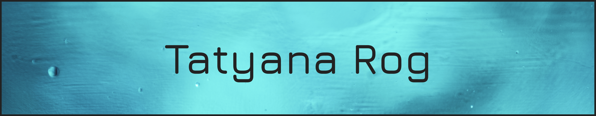
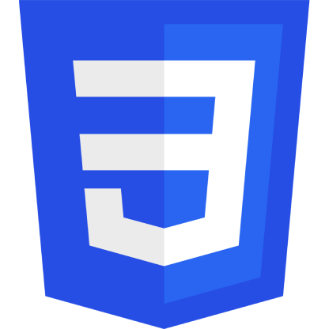
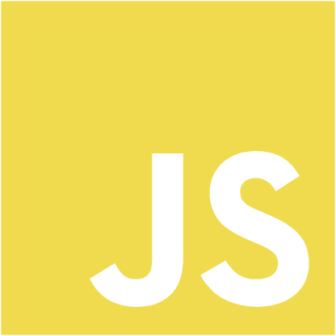
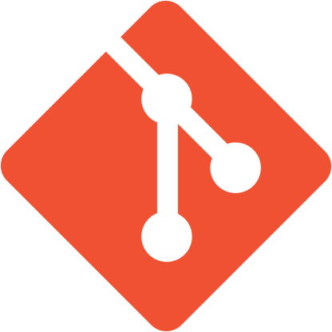
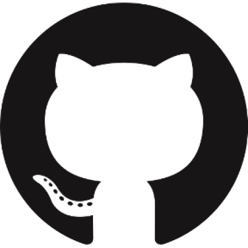
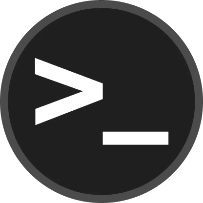
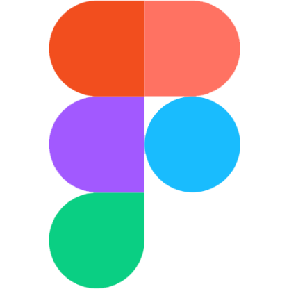
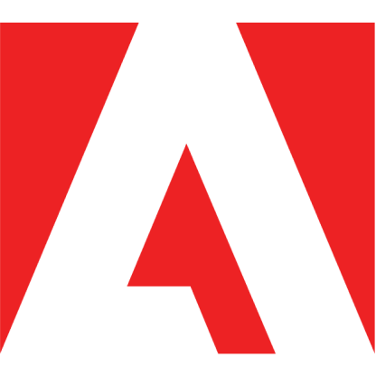

## Hi, my name is Tanya!
# I am a Junior Frontend developer

### Languages and tools:

<!---
- 👋 Hi, I’m @TatyanaRogjnonimikooooooooo
- 👀 I’m interested ingv
- 🌱 I’m currently learning ...
- 💞️ I’m looking to collaborate on ...
- 📫 How to reach me ...
--->

<!---
TatyanaRog/TatyanaRog is a ✨ special ✨ repository because its `README.md` (this file) appears on your GitHub profile.
You can click the Preview link to take a look at your changes.
--->
